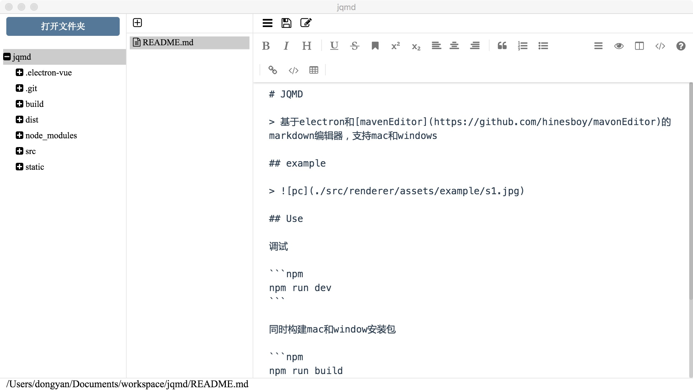

# JQDM

> 基于electron和[mavenEditor](https://github.com/hinesboy/mavonEditor)的markdown编辑器，支持mac和windows

## example



## Use

调试
```
npm run dev
```

同时构建mac和window安装包
```
npm run build
```

## License

MIT
